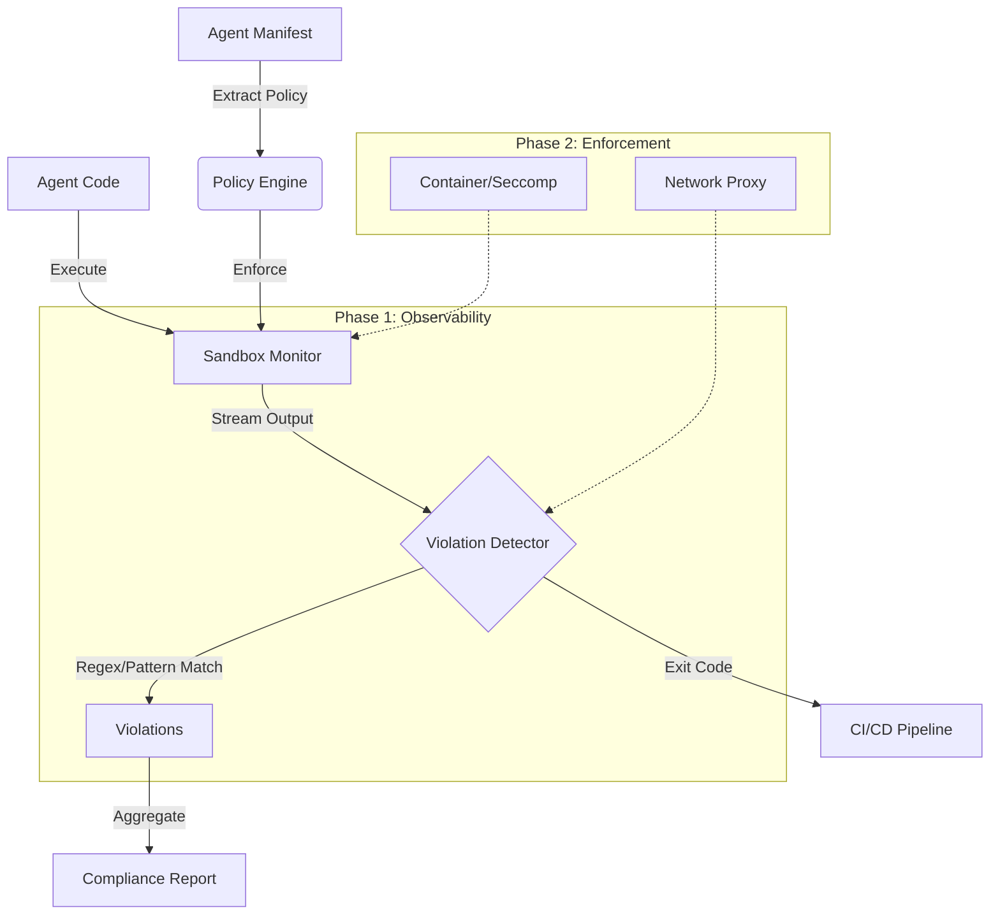

# Beltic Sandbox: Trust & Compliance Layer

## Executive Summary (ROI & Value)

The **Beltic Sandbox** bridges the gap between *identity verification* (FACT™) and *behavioral compliance*. While FACT™ proves **who** an agent is, the Sandbox proves **what** an agent does.

**Business Impact:**
- **De-risks Enterprise Adoption:** Provides the compliance audit trail (JSON reports) that enterprise CISOs require.
- **Accelerates Deployment:** Replaces manual security reviews with automated CI/CD gates.
- **Completes the Trust Stack:** Identity + Compliance = Complete Trust.

---

## Architecture

The sandbox operates as a pre-deployment verification layer. It extracts policies directly from the agent's manifest, ensuring that the code matches its declared capabilities.



### Core Components
1.  **Policy Engine (`src/sandbox/policy.rs`)**: Parses `agent-manifest.json` to determine allowed network domains, file paths, and tools.
2.  **Monitor (`src/sandbox/monitor.rs`)**: Spawns the agent process, capturing `stdout`/`stderr` in real-time.
3.  **Violation Detector**: Analyzes the stream for:
    *   **Network Access**: Checks against `allowed_domains` and `prohibited_domains`.
    *   **PII Exposure**: Detects Email, SSN, Credit Card patterns.
    *   **Prohibited Use Cases**: Flags keywords related to banned activities.
4.  **Report Generator (`src/sandbox/report.rs`)**: Produces a JSON artifact with a risk score (0-100).

---

## Testing Logic & Methodology

### Phase 1: Observability-First (Current)
*Goal: Catch accidental violations and "noisy" malicious behavior.*

| Detection Type | Logic | Limitation |
| :--- | :--- | :--- |
| **Network** | Regex scan for `http(s)://` in logs. Checks against Allow/Deny lists. | Misses silent/encrypted calls not logged to console. |
| **Filesystem** | Detects `ENOENT`/`EACCES` error strings in logs. | Cannot see successful reads of sensitive files. |
| **PII** | Pattern matching (Regex) for sensitive data formats. | Can be bypassed with obfuscation. |

**Why this matters:** This catches the "80% case"—developer errors, misconfigured agents, and verbose libraries. It is the perfect "smoke test" for CI/CD.

### Phase 2: Hard Enforcement (Roadmap)
*Goal: Prevent malicious behavior at the kernel level.*

1.  **Network Proxy**: Route all traffic through a local proxy (e.g., `mitmproxy`) to inspect actual HTTP headers and bodies.
2.  **Syscall Interception**: Use `seccomp` or `eBPF` to block `open()`, `connect()`, and `execve()` calls that violate policy.
3.  **Containerization**: Run agents in ephemeral Docker containers with strict resource limits.

---

## Security Deep Dive

During the development of the Sandbox, we conducted a security review of the CLI to ensure it meets enterprise standards.

### Key Findings & Mitigations
*   **Path Traversal**: Identified and fixed potential vulnerabilities where manifest paths could reference system files (e.g., `../../etc/passwd`).
*   **Crypto Hardening**: Enhanced test coverage for edge cases in signature verification (e.g., algorithm confusion).
*   **Prohibited Domains**: Implemented a "Deny List" for known malicious domains (e.g., `pastebin.com`) to prevent data exfiltration.

---

## Usage Guide

### 1. Interactive Testing
Run the agent locally to see violations in real-time.

```bash
beltic sandbox \
  --manifest agent-manifest.json \
  --command "node agent.js" \
  --show-policy
```

### 2. CI/CD Integration
Fail the build if the agent is non-compliant.

```yaml
# .github/workflows/compliance.yml
- name: Beltic Sandbox Compliance
  run: |
    beltic sandbox \
      --manifest agent-manifest.json \
      --command "npm start" \
      --output report.json
```

### 3. Reviewing Reports
The `sandbox-report.json` provides a detailed audit trail.

```json
{
  "summary": {
    "compliant": false,
    "riskScore": 85,
    "exitCode": 1
  },
  "violations": [
    {
      "type": "NetworkAccessDenied",
      "severity": "High",
      "details": "Attempted access to prohibited domain: pastebin.com"
    }
  ]
}
```
